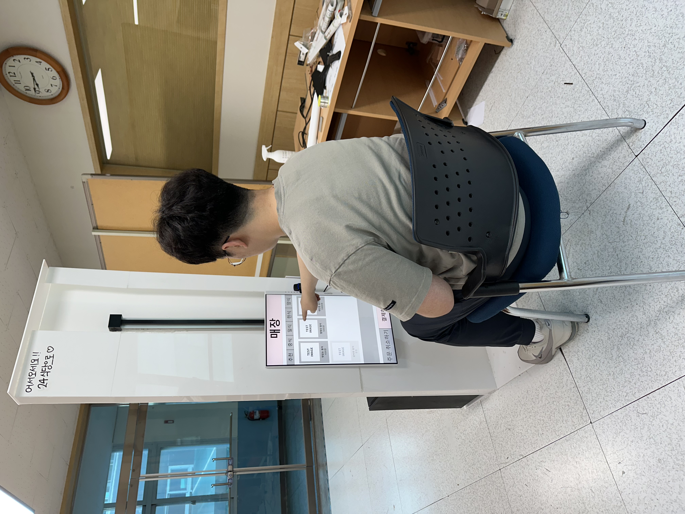
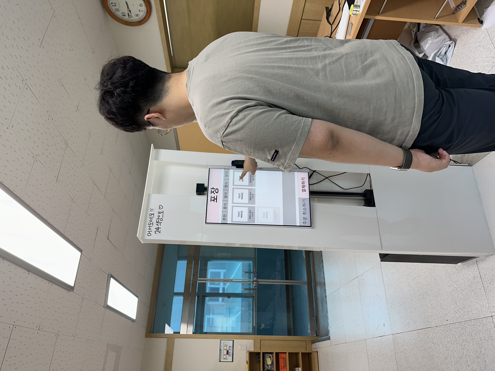

# 키오스크 쉽다 쉬워~ 유니버셜 키오스크 개발

## 프로젝트 개요

코로나19 팬데믹 이후 식당·공공시설에서 키오스크 사용이 급증하였으나, 고령층과 장애인 등 **디지털 소외 계층**은 여전히 큰 불편을 겪고 있습니다.

- 60대 이상의 키오스크 주 1회 이용 비율은 **36%**로 20대(78%)와 큰 격차
- 60대 이상의 **62%**가 대면 거래를 선호 (한국소비자원)
- 노인의 **64.2%**가 키오스크 식당 주문에서 불편함을 경험 (보건복지부, 2020 노인실태조사)
- 휠체어 사용자는 키오스크 화면 높이로 인해 이용 자체가 불가능한 경우 존재

이를 해결하기 위해 **소프트웨어적 UI/UX 개선**과 **하드웨어적 높이 자동 조절** 기능을 모두 갖춘 접근성 키오스크를 개발합니다.

## 개발 목표

**가. 소프트웨어적 개선**
- 60대 이상의 키오스크 불편 1·2순위인 **조작 어려움**과 **검색 어려움** 해소
- 경로당 방문 현장 조사를 통해 수집한 실제 노인 불편 사례를 반영
- 글씨 크기 확대, 단순한 UI, 연령대별 추천 메뉴 제공

**나. 하드웨어적 개선**
- 웹캠 + OpenCV 얼굴 인식으로 사용자의 눈높이를 감지
- Arduino + 리니어 액추에이터로 키오스크 화면 높이를 자동 조절
- 휠체어 탑승자·어린이·키가 작은 사용자 모두 대응

## 시스템 아키텍처

```
[웹캠] → [OpenCV 얼굴 위치 인식]
              ↓
         [Python / Flask API]
         ↙           ↘
[Arduino + 리니어 액추에이터]   [프론트엔드 키오스크 UI]
  (높이 자동 조절)                  ↕ HTTP 통신
                              [DB (메뉴/결제 정보)]
```

## 기술 스택

| 분류 | 기술 |
|------|------|
| 얼굴 인식 | Python, OpenCV |
| 백엔드 API | Python, Flask |
| 하드웨어 제어 | Arduino, 리니어 액추에이터 |
| 데이터베이스 | SQLite |
| 프론트엔드 | React |


## API 설계

| 엔드포인트 | Method | 기능 | 응답 |
|---|---|---|---|
| 메뉴 요청 | GET | DB에서 전체 메뉴 반환 | 메뉴 목록 |
| 추천 메뉴 요청 | GET | 연령대별 추천 메뉴 필터링 | 추천 메뉴 목록 |
| 높낮이 조절 요청 | POST | OpenCV로 얼굴 위치 인식 → 화면 높이 조절 | 조절 완료 |
| 결제 요청 | POST | 카드 삽입 확인 → 구매 정보 DB 저장 | 결제 완료 / 오류 |
| 나이 판별 요청 | GET | 얼굴 감지 → 연령대 반환 | 나이 정보 or 404 |


## DB

**메뉴 테이블**

| 컬럼 | Type | 비고 |
|------|------|------|
| id | INT | Primary Key |
| name | VARCHAR | Not Null |
| description | VARCHAR | Not Null |
| price | INT | Not Null |
| recommendation | VARCHAR(YOUNG, MIDDLE, OLD) | 연령대별 추천 분류 |
| kind | VARCHAR | Not Null (메뉴 종류) |


## 하드웨어 동작 원리
  
1. 웹캠과 키오스크 컴퓨터를 연결
2. OpenCV 라이브러리로 사용자 얼굴 위치 실시간 감지
3. 얼굴이 카메라 **정가운데**에 들어오는 순간을 기준으로 높이 결정
4. Python → Arduino Serial 통신으로 멈춤 신호 전달
5. Arduino가 **리니어 액추에이터**를 구동하여 화면 높이 자동 조절


## 참고 문헌

- 한국소비자원, 키오스크 이용 실태조사
- 보건복지부, 2020 노인실태조사
- 과학기술정보통신부, 2021 디지털정보격차실태조사
- 곽미소, 김철수. "국내 키오스크의 사용자 분석과 디자인 개선 방향에 관한 연구." 한국융합학회논문지 13, no. 4 (2022)
